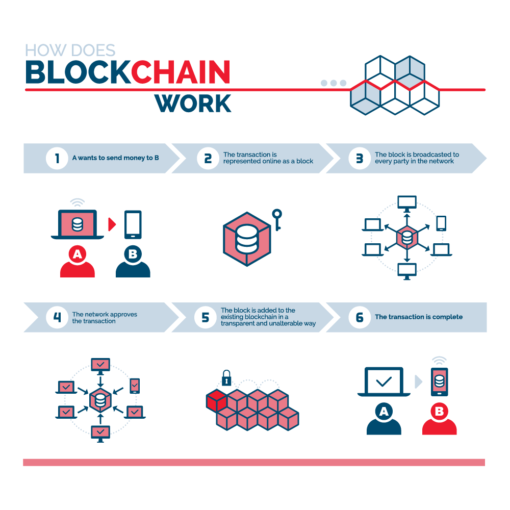
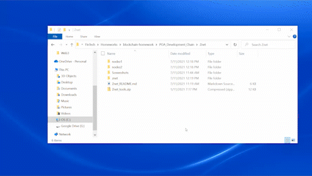
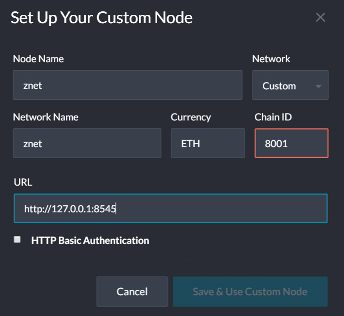
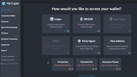

# Welcome to Zbank's Znet blockchain

This is a useable pilot of our company's new blockchain called Znet.  

This README will explain how AND give reasons why the blockchain was setup. Above all else, it will provide clear instructions on how to use it and outline some real world use cases. 

Terminology used throughout this README will be translated for the layman so you can begin understanding what the "geeks" are talking about when you encounter other blockchains from henceforth. If this is your first time here there are links to click along the way that will offer more thorough explanations. It will be assumed that you are reading these links as you progress through this README. Here's an image that will begin to paint a picture: 

This pilot [blockchain](https://www2.deloitte.com/ch/en/pages/strategy-operations/articles/blockchain-explained.html) is termed a ["testnet"](https://en.bitcoin.it/wiki/Testnet). Testnets use fake [tokens](https://www.investopedia.com/terms/c/crypto-token.asp_) to transact on a fictitious blockchain just like monopoly money transacts within monopoly. It's all pretend, so go for it!

To transact on Znet we need at least 2 nodes setup: One to send tokens and one to receive tokens. We will call these nodes `nodez1` and `nodez2` respectively. 

To validate our transactions within Znet we will use a [Proof of Authority (PoA) algorithm](https://en.wikipedia.org/wiki/Proof_of_authority) which is typically used for private blockchain networks as it requires pre-approval of, or voting in of, the account addresses or [nodes](https://coinmarketcap.com/alexandria/article/what-is-a-node) that can approve transactions (seal blocks).  

Hopefully now you have a little understanding of blockchain lingo. Let's start up our blockchain! 

1. Click our [Znet repository link](https://github.com/shawry6/blockchain-homework/tree/main/POA_Development_Chain) and download the `Znet` folder. 

2. Go to to and open the Znet folder and unzip the `Znet_tools` folder to expand all the necessary blockchain tools (executable files) we will need to run our blockchain. 

3. Right click in the `Znet` folder and run any [command terminal](https://askubuntu.com/questions/38162/what-is-a-terminal-and-how-do-i-open-and-use-it). This example uses Git Bash, see below:  

    

4. Copy (ctrl+c) the below line of code into the first line of the terminal to start `nodez1`: 

        ./geth --datadir nodez1 --unlock "B73efd3E8D587c28D5E86258ca7d3Bb823580CD9" --mine --rpc --allow-insecure-unlock

5. Repeat step 3 and open a new terminal window and paste this line of code into the first line to start `nodez2`:

        ./geth --datadir nodez2 --unlock "a15727c4CFAf244a05F0C9A4f2b93A41D673D0C5" --mine --port 30304 --bootnodes "enode://0a126520969bcdf5228e0a333b26ac9304f5305643ae8c65b8ae2ef2d71114fb6a4d33fe281cfd4b66154fbf79e142b457a2bf2115cd54f10552044a1e4453a5@127.0.0.1:30303" --ipcdisable --allow-insecure-unlock

6. Your private PoA blockchain should now be running!

    

7. With both nodes up and running, the blockchain can be added to your MyCrypto for testing.

    * Go to [MyCrypto](https://download.mycrypto.com/) and download it
    
    * Open the MyCrypto app, then click `Change Network` at the bottom left:

    

    * Click "Add Custom Node", then add the custom network information below: 

    

    * Finally, click `Save & Use Custom Node`. 

7. After connecting to the custom network in MyCrypto, it can be tested by sending money between accounts.

    * Select the `View & Send` option from the left menu pane, then click `Keystore file`:
            
        

    * On the next screen, click `Select Wallet File`, then navigate to the keystore directory inside your nodez1 directory, select the file located there, enter password 9999 when prompted and then click `Unlock`.

    * This will open your account wallet inside MyCrypto. 
    
    * Looks like we're filthy rich! This is the balance that was pre-funded for this account in the genesis configuration; however, these millions of ETH tokens are just for testing purposes.   

    
    * In the `To Address` box, type the account address from nodez2 (0xa15727c4CFAf244a05F0C9A4f2b93A41D673D0C5), then fill in an arbitrary amount of ETH:

     

    * Confirm the transaction by clicking "Send Transaction", and the "Send" button in the pop-up window.  

    

    * Click the `Check TX Status` when the green message pops up, confirm the logout:

    

    * You should see the transaction go from `Pending` to `Successful` in around the same blocktime you set in the genesis.

    * You can click the `Check TX Status` button to update the status.

    

Congratulations, you successfully transacted on our Znet blockchain!